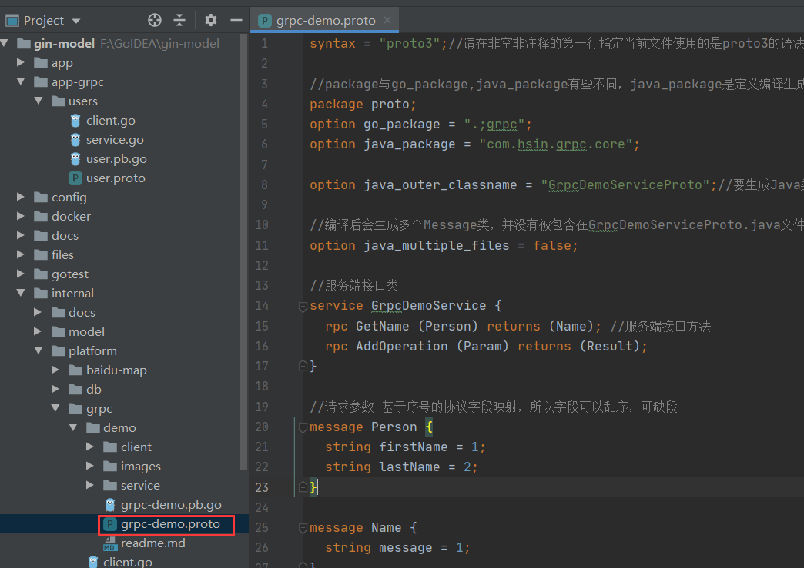
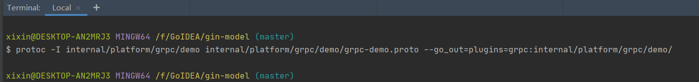
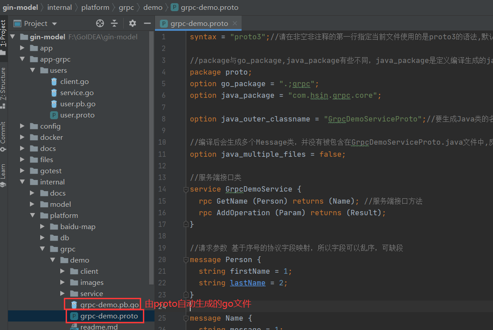
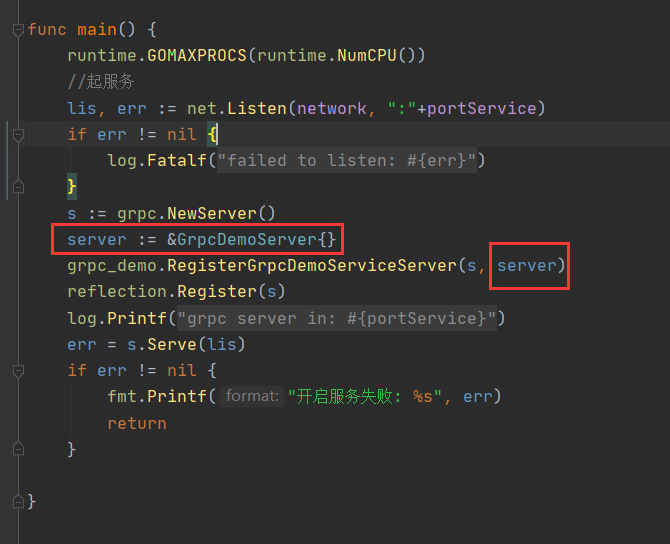
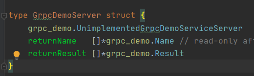
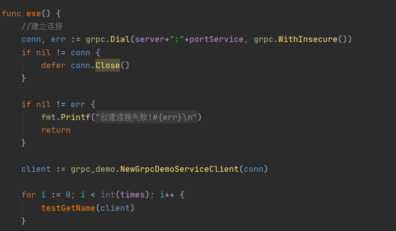
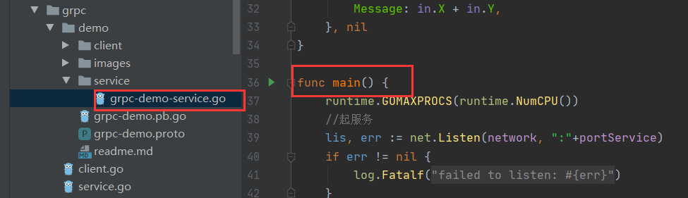
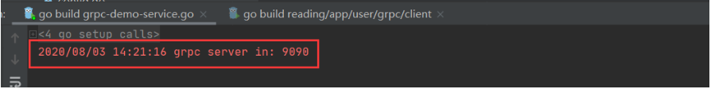
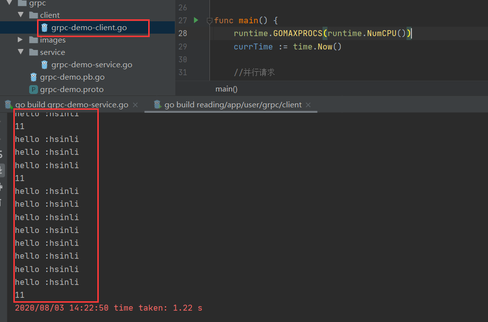

本项目为GRPC示例项目,此处为Go端项目,可独立运行,也可结合Java项目grpc-java/src/main/proto/grpc-demo.proto对应的项目配合使用

使用方式: 

先编写xxx.proto文件到某个目录下,  .proto文件可参考 `./grpc-demo.proto`



编写完成后打开Goland的Terminal, 在主目录下输入:

```shell
cd library/platform/grpc/demo
protoc -I ./ grpc-demo.proto --go_out=plugins=grpc:.
```



```shell
其中:
-I    后面指定proto文件存放目录和proto文件
--go_out=plugins=grpc:   后面指定生成 .pb.go 代码存放的目录
```


之后会在下图目录中生成一个 .pb.go 文件,  **此文件不要去编辑它**




然后开始编写Go的服务端,重点如下图






客户端重点如下:




至此 Go项目的Grpc示例项目编写完成, 启动`./service/grpc-demo-service.go`可以启动服务端:






服务端启动后, 启动客户端:




以上就是 Go端测试结果.

**当配合 Java/grpc-java项目使用时, .proto文件在不同语言之间也应该保持一模一样, Go项目可以作为服务器, Java项目作为客户端; 也可以 Java作为服务端, Go项目作为客户端**

